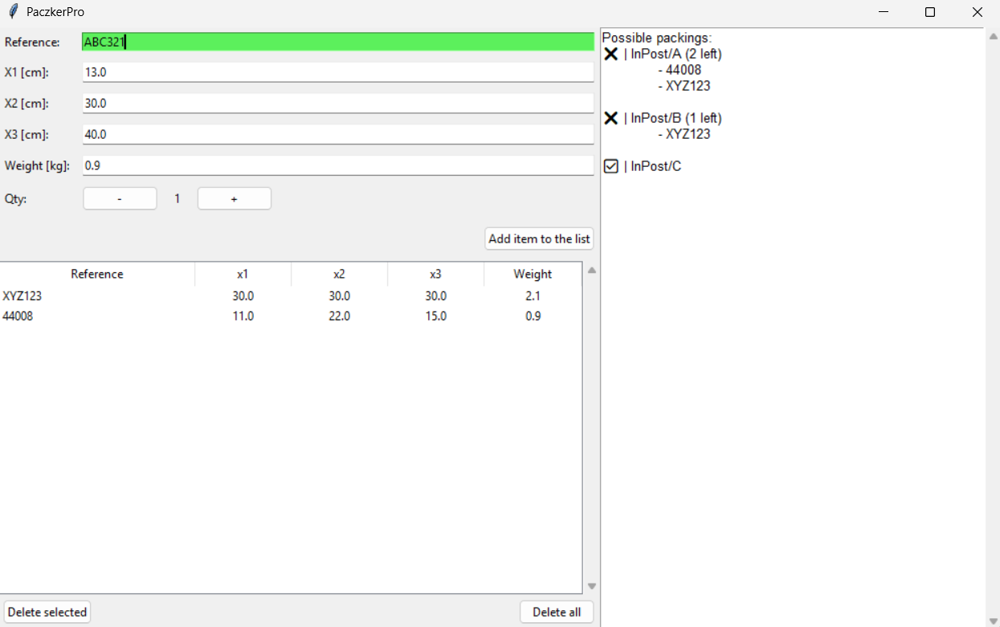
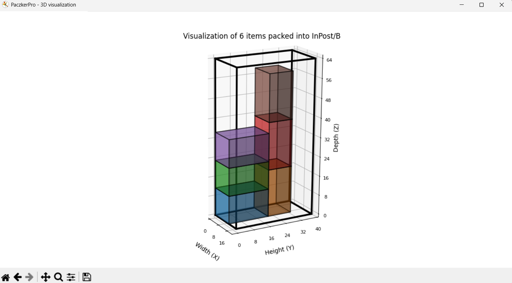

# 📦 Simple 3D Parcel Packing Assistant

## Project Overview

This is a **simple Python GUI application** built with **Tkinter** that uses the **py3dbp** (3D Bin Packing) module.

The tool allows users to **quickly check if and how a given list of items can be packed into defined parcel sizes**, such as the standard dimensions used by carriers like InPost (or any other configured company).

Data can be entered very fast. **Products dimensions and weight are filled automatically based on reference** if suitable csv file is provided.

**Packing 3D visualisation** is avaliable.

## Who uses this?

This application is ideal for **E-commerce Sellers** to rapidly determine the most economical parcel size and avoid surcharges for incorrect dimensions.

## Screenshots

A simple look at the interface:

 

## Credit
- https://github.com/enzoruiz/3dbinpacking